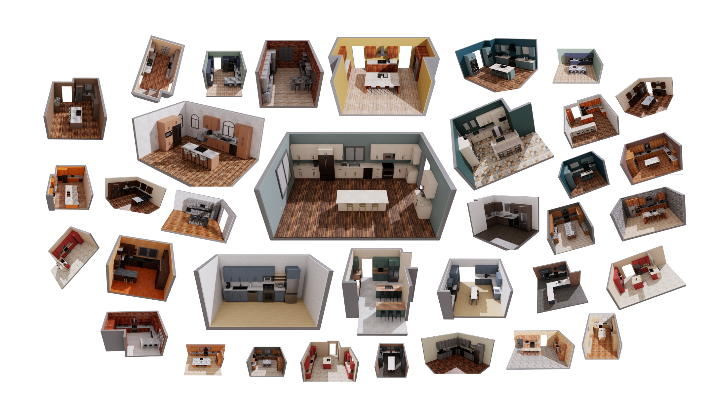

# LwLab

<div align="center">


**A large-scale simulation framework built on Isaac Lab for training robots to perform common daily life tasks**

[](https://www.python.org/downloads/)
[](https://developer.nvidia.com/cuda-toolkit)
[](https://isaac-sim.github.io/IsaacLab/)
[](https://www.apache.org/licenses/LICENSE-2.0)
[](https://lwlab-docs.lightwheel.net/)


[Documentation](https://lwlab-docs.lightwheel.net/) • [Quick Start](#quick-start) • [Installation](#installation) • [Project Structure](#project-structure)

</div>

---

## Overview

**LwLab** is a cutting-edge robotics simulation framework developed by the **Lightwheel team**, specifically designed for training robots in kitchen manipulation and loco-manipulation tasks. Built on NVIDIA's Isaac Lab, LwLab provides a comprehensive platform that seamlessly integrates teleoperation data collection with reinforcement learning training workflows.

### Key Features

- **Multi-Robot Support** - Compatible with diverse robots including Unitree G1, PandaOmron, and DoublePanda  
- **Realistic Kitchen Environments** - Large-scale, high-quality kitchen scenarios for comprehensive training  
- **Flexible Input Methods** - Support for keyboard, VR controllers, and other input devices  
- **Complete Data Pipeline** - End-to-end workflow from teleoperation to policy deployment  
- **Modular Configuration** - Highly customizable scene layouts and task specifications  
- **Comprehensive APIs** - Specialized interfaces for success evaluation and reward design

## Quick Start

### Prerequisites

- **OS**: Linux (Primary support) / NVIDIA GPU required
- **Python**: 3.11
- **CUDA**: 12.8 (Recommended)
- **NVIDIA Driver**: 570.133.07 (Recommended)
- **Hardware**: NVIDIA RTX GPU for optimal ray-tracing performance

### Installation

1. **Create Conda Environment**
```bash
conda create -n lwlab python=3.11 -y
conda activate lwlab
```

2. **Quick Install**
```bash
git clone http://git.lightwheel.ai/robot/lwlab.git
cd lwlab
bash ./install.sh # Refer to the Documentation for custom installation steps
```


## Launch Your Task


### Teleoperation Data Collection

Start collecting demonstration data with different robot configurations:

```bash
# Use G1-Hand robot configuration
python ./lwlab/scripts/teleop/teleop_main.py --task_config g1-hand

# Use Panda+Omron robot configuration  
python ./lwlab/scripts/teleop/teleop_main.py --task_config pandaomron
```

### Trajectory Replay

Replay collected demonstrations for analysis:

```bash
# State-based replay
python ./lwlab/scripts/teleop/replay_demos.py --dataset_file "/path/to/your/dataset.hdf5"

# Action-based replay
python ./lwlab/scripts/teleop/replay_action_demo.py \
    --dataset_file /path/to/your/dataset.hdf5 \
    --replay_mode action # or joint_target mode
```

### Reinforcement Learning

LwLab provides a complete RL pipeline:

```bash
# Start training with default configuration
bash train.sh # default preset uses LiftObj (state variant)

# Custom training configuration
python ./lwlab/scripts/rl/train.py \
    --task_config g1_liftobj \
    --headless \
```

### Policy Evaluation

Evaluate your trained policies:

```bash
# Evaluate with default settings
bash eval.sh

# Custom evaluation
python ./lwlab/scripts/rl/play.py \
    --task_config g1_liftobj \
    # --enable_camera \
    # --headless
```


## Project Structure


### Core Components

| Component | Description |
|-----------|-------------|
| **configs** | This directory contains configuration files related to data collection, as well as the training and evaluation of reinforcement learning tasks. |
| **lwlab** | This module provides `core` functionalities, including simulation scene generation, asset logic control, robot control, entry-point scripts, and utility functions. The core submodule offers standardized interfaces for common tasks, such as success criteria evaluation (`check_success_api`) and reward function design (`reward_design_api`). |
| **policy** | This directory focuses on the implementation of policy algorithms, covering both imitation learning (IL) and reinforcement learning (RL) strategies. The codebase is designed for modular experimentation and systematic benchmarking of various policy architectures. |
| **third_party** | This folder contains third-party environment dependencies, such as IsaacLab, Robocasa, and Robosuite. To ensure reproducibility and maintainability, these environments are preserved in their original form as much as possible. |
| **tasks** | This directory defines task specifications. Each task, such as `OpenOven`, includes its own success criteria, task-related asset control and item placement, as well as a detailed task description. |


### Launch Scripts

- **`teleop.sh`** - Launches the teleoperation mode, allowing real-time robot control via VR controllers or other input devices. Useful for data collection, demonstration, or manual intervention scenarios.
- **`train.sh`** - Starts the training process for reinforcement learning or imitation learning. This script automatically loads configuration files, initializes environments and policies, and begins the training loop.
- **`eval.sh`** - Evaluates trained policies or models. Supports performance testing across different tasks and environments, and outputs evaluation metrics.
- **`install.sh`** - Installs all required dependencies for the project, including Python packages, third-party libraries, and some system dependencies, ensuring a consistent development and runtime environment.

## Documentation

For comprehensive guides, API references, and advanced usage examples, visit our [Official Documentation](https://lwlab-docs.lightwheel.net/).

## License

This project is licensed under the [Apache License 2.0](https://www.apache.org/licenses/LICENSE-2.0).

Copyright 2025 Lightwheel Team